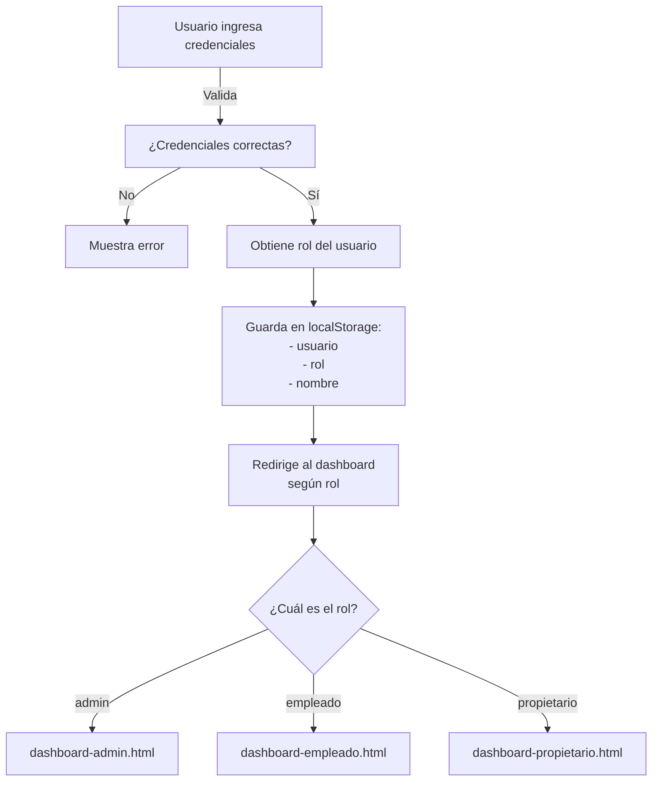

# 🔐 Sistema de Login con Roles y Dashboards - Documentación

## 📚 Conceptos de Desarrollo

Este proyecto implementa un **sistema de autenticación basado en roles (RBAC - Role Based Access Control)**, un patrón muy común en aplicaciones web modernas.

### ¿Qué es un Sistema de Roles?

Un sistema de roles permite que diferentes usuarios tengan acceso a diferentes funcionalidades según su "rol" en la aplicación. Esto es fundamental para:

- **Seguridad**: Proteger información sensible
- **Escalabilidad**: Facilitar agregar nuevos roles
- **Mantenibilidad**: Código organizado y modular

---

## 🎯 Estructura del Sistema

### 1️⃣ Usuarios y Roles

#### Datos definidos en `main.js`:

```javascript
const USUARIOS_VALIDOS = [
  // Administradores
  { usuario: "admin", clave: "admin", rol: "admin", nombre: "Administrador" },

  // Empleados
  {
    usuario: "empleado1",
    clave: "emp123",
    rol: "empleado",
    nombre: "Juan Pérez",
  },
  {
    usuario: "empleado2",
    clave: "emp456",
    rol: "empleado",
    nombre: "María García",
  },

  // Propietarios/Clientes
  {
    usuario: "propietario1",
    clave: "1234",
    rol: "propietario",
    nombre: "Carlos López",
  },
  {
    usuario: "propietario2",
    clave: "5678",
    rol: "propietario",
    nombre: "Ana Martínez",
  },
];
```

**Desglose:**

- **admin**: Acceso total al sistema
- **empleado**: Puede gestionar propiedades y consultas de clientes
- **propietario**: Cliente que puede ver sus propiedades y reservas

---

### 2️⃣ Flujo de Login



---

### 3️⃣ LocalStorage - Persistencia de Datos

Los datos se guardan en `localStorage` del navegador:

```javascript
localStorage.setItem("uh_usuario", usuario); // Nombre de usuario
localStorage.setItem("uh_rol", valido.rol); // Rol (admin/empleado/propietario)
localStorage.setItem("uh_nombre", valido.nombre); // Nombre completo
```

**Ventaja**: El usuario sigue logueado aunque cierre el navegador.

---

## 🔒 Validación de Acceso en Dashboards

Cada dashboard verifica que el usuario tenga permiso:

```javascript
// En dashboard-admin.html
document.addEventListener("DOMContentLoaded", () => {
  const rol = localStorage.getItem("uh_rol");

  if (rol !== "admin") {
    alert("Acceso denegado. Solo administradores pueden acceder.");
    window.location.href = "../index.html";
    return;
  }
  // ... resto del código
});
```

**Esto previene:**

- Que un empleado acceda al dashboard de admin
- Que un propietario vea datos de administración
- Acceso no autorizado mediante URL directa

---

## 🧪 Pruebas - Credenciales de Acceso

### Para probar el sistema, usa estos usuarios:

#### Admin (Acceso Total)

```
Usuario: admin
Contraseña: admin
```

→ Accede a: **Dashboard Administrador**

#### Empleado

```
Usuario: empleado1
Contraseña: emp123
```

→ Accede a: **Dashboard Empleado**

#### Propietario

```
Usuario: propietario1
Contraseña: 1234
```

→ Accede a: **Dashboard Propietario**

---

## 📦 Nuevas Funciones Agregadas

### `obtenerDashboardPorRol(rol)`

```javascript
function obtenerDashboardPorRol(rol) {
  const dashboards = {
    admin: "dashboard-admin.html",
    empleado: "dashboard-empleado.html",
    propietario: "dashboard-propietario.html",
  };
  return dashboards[rol] || "propiedades.html";
}
```

**Uso**: Determina qué dashboard debe ver cada usuario.

---

## 🎨 Dashboards Creados

### 1. **Dashboard Administrador** 📊

**Archivo**: `pages/dashboard-admin.html`

**Funcionalidades:**

- Gestión de propiedades (crear, editar, eliminar)
- Gestión de usuarios
- Reportes y estadísticas
- Configuración del sistema
- Auditoría

**Color Tema**: Púrpura (#667eea)

---

### 2. **Dashboard Empleado** 👷

**Archivo**: `pages/dashboard-empleado.html`

**Funcionalidades:**

- Ver propiedades asignadas
- Gestionar consultas de clientes
- Programar visitas
- Ver desempeño y comisiones
- Gestionar documentos

**Color Tema**: Rosa (#f5576c)

---

### 3. **Dashboard Propietario** 🏡

**Archivo**: `pages/dashboard-propietario.html`

**Funcionalidades:**

- Ver propiedades en portafolio
- Gestionar inquilinos e ingresos
- Reportar mantenimiento
- Descargar documentos
- Ver reservas

**Color Tema**: Azul (#4facfe)

---

## 📝 Cambios Realizados en `main.js`

### 1. Estructura mejorada de usuarios (con roles):

```javascript
// ANTES
const USUARIOS_VALIDOS = [
  { usuario: "propietario1", clave: "1234" },
  { usuario: "propietario2", clave: "5678" },
  { usuario: "admin", clave: "admin" },
];

// AHORA
const USUARIOS_VALIDOS = [
  { usuario: "admin", clave: "admin", rol: "admin", nombre: "Administrador" },
  {
    usuario: "empleado1",
    clave: "emp123",
    rol: "empleado",
    nombre: "Juan Pérez",
  },
  {
    usuario: "propietario1",
    clave: "1234",
    rol: "propietario",
    nombre: "Carlos López",
  },
];
```

### 2. Redirección inteligente según rol:

```javascript
// ANTES
window.location.href = "propiedades.html"; // Todos van al mismo lugar

// AHORA
const dashboard = obtenerDashboardPorRol(valido.rol);
window.location.href = dashboard; // Cada uno a su dashboard
```

### 3. Guardado de datos completos:

```javascript
localStorage.setItem("uh_usuario", usuario);
localStorage.setItem("uh_rol", valido.rol);
localStorage.setItem("uh_nombre", valido.nombre);
```

### 4. Mostrar rol en la interfaz:

```javascript
// ANTES
saludoEl.textContent = `Hola, ${usuario}`;

// AHORA
saludoEl.textContent = `Hola, ${nombre || usuario} (${rol || "usuario"})`;
```

---

## 🔍 Conceptos de Desarrollo Utilizados

### 1. **Autenticación**

- Validación de credenciales
- Almacenamiento seguro de sesión (localStorage)

### 2. **Autorización**

- Verificación de roles antes de acceder
- Redirección a páginas no autorizadas

### 3. **Persistencia de Datos**

- Uso de localStorage para mantener sesión activa
- Limpieza al logout

### 4. **Mantenimiento de Código**

- Función reutilizable `obtenerDashboardPorRol()`
- Código modular y escalable

---

## 🚀 Mejoras Futuras Recomendadas

```javascript
// 1. Backend con base de datos
// Almacenar usuarios en servidor en lugar de hardcodear

// 2. Seguridad mejorada
// - Encriptación de contraseñas (hash)
// - JWT tokens en lugar de localStorage
// - Sesiones con expiración

// 3. Más roles y permisos
// - Permisos granulares por acción
// - Sistema de ACL (Access Control List)

// 4. Auditoría
// - Registrar acciones de usuarios
// - Log de cambios en propiedades

// 5. Recuperación de contraseña
// - Envío de email de reset
// - Preguntas de seguridad
```

---

## 🔧 Cómo Agregar un Nuevo Rol

### Paso 1: Agregar usuario en `main.js`

```javascript
const USUARIOS_VALIDOS = [
  // ... usuarios existentes
  {
    usuario: "gerente",
    clave: "ger123",
    rol: "gerente",
    nombre: "Pedro Sánchez",
  },
];
```

### Paso 2: Agregar dashboard en `obtenerDashboardPorRol()`

```javascript
function obtenerDashboardPorRol(rol) {
  const dashboards = {
    admin: "dashboard-admin.html",
    empleado: "dashboard-empleado.html",
    propietario: "dashboard-propietario.html",
    gerente: "dashboard-gerente.html", // NUEVO
  };
  return dashboards[rol] || "propiedades.html";
}
```

### Paso 3: Crear `dashboard-gerente.html`

Copiar uno de los dashboards existentes y personalizar.

---

## ✅ Checklist de Seguridad

- ✅ Validación de credenciales en login
- ✅ Verificación de rol en cada dashboard
- ✅ Limpieza de datos al logout
- ✅ Redirección a inicio si acceso no autorizado
- ⚠️ TODO: Encriptación de contraseñas (para producción)
- ⚠️ TODO: Tokens JWT (para producción)

---

## 📞 Soporte

Para preguntas sobre el sistema de login o roles:

1. Revisa la estructura de `main.js`
2. Consulta el código de los dashboards
3. Prueba con los usuarios de ejemplo

---

**Creado para aprendizaje de desarrollo web moderno** 🎓
